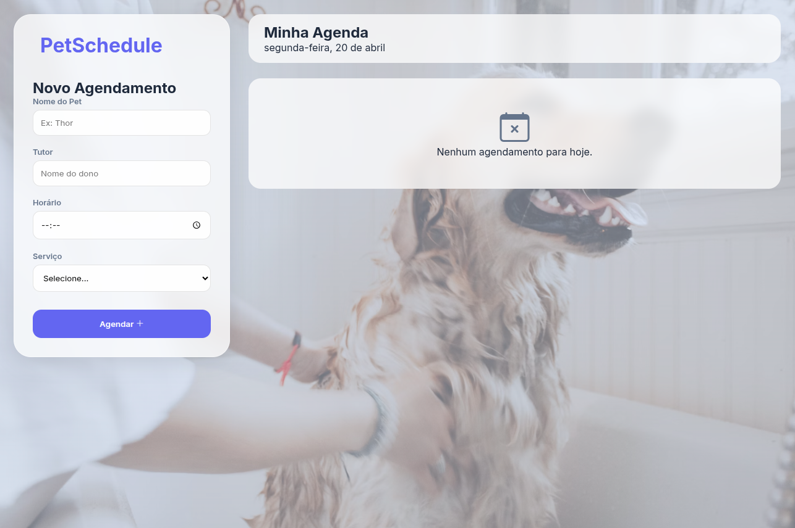

# 🐾 PetSchedule — Gestão de Agendamentos

O **PetSchedule** é uma aplicação web moderna e responsiva desenvolvida para facilitar o dia a dia de pet shops. Com uma interface inspirada no estilo *Glassmorphism* (efeito de vidro), o sistema permite gerenciar banhos, tosas e consultas de forma intuitiva, garantindo que nenhum pet perca seu horário.



## ✨ Funcionalidades

- **Agendamento Dinâmico:** Adicione nome do pet, tutor, serviço e horário.
- **Ordenação Automática:** A lista de compromissos é organizada automaticamente pelo horário.
- **Persistência de Dados:** Os agendamentos ficam salvos no navegador (LocalStorage), então você não perde os dados ao atualizar a página.
- **Interface Responsiva:** Experiência otimizada para Desktop e dispositivos Mobile.
- **Feedback Visual:** Efeitos de hover, animações de entrada e desfoque de fundo (Blur).

## 🚀 Tecnologias Utilizadas

Este projeto foi construído utilizando as melhores práticas de desenvolvimento front-end:

- **HTML5:** Estrutura semântica e acessível.
- **CSS3:** Estilização avançada com Flexbox, Grid e variáveis CSS.
- **JavaScript (ES6+):** Manipulação de DOM, gerenciamento de estados e LocalStorage.
- **Bootstrap Icons:** Biblioteca de ícones modernos.
- **Google Fonts:** Tipografia focada em legibilidade (Inter).

## 📦 Como rodar o projeto

1. Clone este repositório:
   ```bash
   git clone [https://github.com/seu-usuario/nome-do-repositorio.git](https://github.com/seu-usuario/nome-do-repositorio.git)
